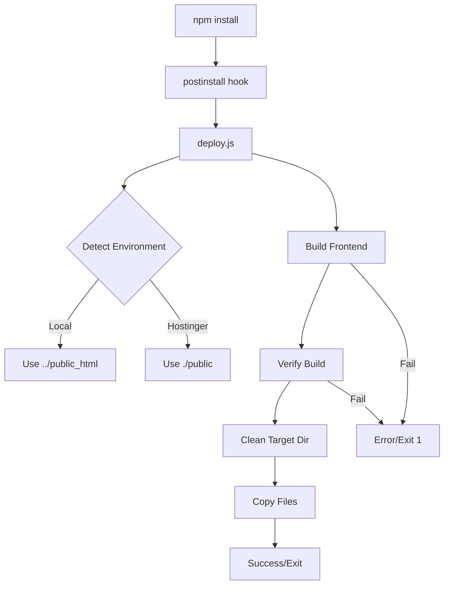
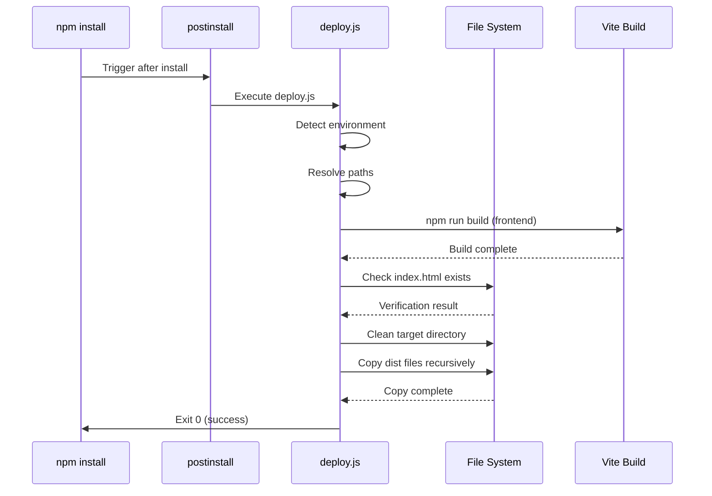

# Design Document: Hostinger Deploy Configuration

## Overview

Este documento descreve o design de baixo nível para automatizar o processo de deploy na Hostinger, garantindo que o frontend seja buildado e copiado para o diretório público correto. A solução utiliza um script Node.js executado via postinstall hook que detecta o ambiente de execução e ajusta os caminhos de destino automaticamente.

### Problem Statement

A Hostinger usa a pasta `backend/` como raiz da aplicação, mas o build do frontend (Vite) gera arquivos em `public_html/` na raiz do projeto. Isso resulta em uma estrutura incorreta no servidor, onde os arquivos estáticos não são encontrados.

### Solution Approach

Implementar um script de deploy automatizado que:
1. Detecta o ambiente de execução (local vs Hostinger)
2. Executa o build do frontend usando npm
3. Verifica a integridade do build
4. Copia os arquivos para o diretório público correto baseado no ambiente
5. Limpa arquivos antigos antes de copiar novos (idempotência)

## Architecture

### Component Diagram



### Execution Flow



## Components and Interfaces

### 1. Deploy Script (deploy.js)

**Location:** `backend/scripts/deploy.js`

**Responsibilities:**
- Environment detection
- Path resolution
- Frontend build orchestration
- Build verification
- File system operations (clean, copy)
- Error handling and logging

**Interface:**
```javascript
// No exported functions - standalone script
// Exit codes:
//   0: Success
//   1: Error (any failure)
```

### 2. Package.json Integration

**Location:** `backend/package.json`

**Modification:**
```json
{
  "scripts": {
    "postinstall": "node scripts/deploy.js"
  }
}
```

### 3. Environment Detection Module

**Pseudo-interface:**
```javascript
function detectEnvironment(): 'local' | 'hostinger'
function resolvePublicPath(env: string): string
```

### 4. Build Orchestrator Module

**Pseudo-interface:**
```javascript
function buildFrontend(frontendPath: string): Promise<void>
function verifyBuild(distPath: string): Promise<boolean>
```

### 5. File Operations Module

**Pseudo-interface:**
```javascript
function cleanDirectory(targetPath: string): Promise<void>
function copyRecursive(source: string, target: string): Promise<void>
```

## Data Models

### Path Configuration

```javascript
const PathConfig = {
  // Relative to backend directory
  frontendDir: '../frontend',
  frontendDist: '../frontend/dist',
  
  // Environment-specific public directories
  publicDirLocal: '../public_html',
  publicDirHostinger: './public',
  
  // Verification files
  requiredFiles: ['index.html']
}
```

### Environment Detection Logic

```javascript
const EnvironmentDetection = {
  // Check for Hostinger-specific indicators
  indicators: {
    hostinger: [
      'NODE_ENV=production',
      'existence of ./public directory',
      'absence of ../public_html directory'
    ],
    local: [
      'existence of ../public_html directory',
      'development environment'
    ]
  }
}
```

## Detailed Implementation

### Main Script Structure (deploy.js)

```javascript
const fs = require('fs');
const path = require('path');
const { execSync } = require('child_process');

// ============================================================================
// CONFIGURATION
// ============================================================================

const CONFIG = {
  FRONTEND_DIR: path.resolve(__dirname, '../../frontend'),
  FRONTEND_DIST: path.resolve(__dirname, '../../frontend/dist'),
  PUBLIC_DIR_LOCAL: path.resolve(__dirname, '../../public_html'),
  PUBLIC_DIR_HOSTINGER: path.resolve(__dirname, '../public'),
  REQUIRED_FILES: ['index.html']
};

// ============================================================================
// UTILITY FUNCTIONS
// ============================================================================

/**
 * Logs a message with timestamp
 * @param {string} message - Message to log
 * @param {string} level - Log level (INFO, ERROR, SUCCESS)
 */
function log(message, level = 'INFO') {
  const timestamp = new Date().toISOString();
  const prefix = `[${timestamp}] [${level}]`;
  
  if (level === 'ERROR') {
    console.error(`${prefix} ${message}`);
  } else {
    console.log(`${prefix} ${message}`);
  }
}

/**
 * Checks if a directory exists
 * @param {string} dirPath - Path to check
 * @returns {boolean} True if directory exists
 */
function directoryExists(dirPath) {
  try {
    return fs.statSync(dirPath).isDirectory();
  } catch (error) {
    return false;
  }
}

/**
 * Checks if a file exists
 * @param {string} filePath - Path to check
 * @returns {boolean} True if file exists
 */
function fileExists(filePath) {
  try {
    return fs.statSync(filePath).isFile();
  } catch (error) {
    return false;
  }
}

// ============================================================================
// ENVIRONMENT DETECTION
// ============================================================================

/**
 * Detects the execution environment
 * Algorithm:
 * 1. Check if ./public exists (Hostinger indicator)
 * 2. Check if ../public_html exists (Local indicator)
 * 3. Check NODE_ENV variable
 * 4. Default to local if ambiguous
 * 
 * @returns {'local' | 'hostinger'} Detected environment
 */
function detectEnvironment() {
  log('Detecting execution environment...');
  
  // Primary indicator: Check for Hostinger public directory
  if (directoryExists(CONFIG.PUBLIC_DIR_HOSTINGER)) {
    log('Detected Hostinger environment (./public exists)', 'INFO');
    return 'hostinger';
  }
  
  // Secondary indicator: Check for local public_html directory
  if (directoryExists(CONFIG.PUBLIC_DIR_LOCAL)) {
    log('Detected local environment (../public_html exists)', 'INFO');
    return 'local';
  }
  
  // Tertiary indicator: Check NODE_ENV
  if (process.env.NODE_ENV === 'production') {
    log('Detected production environment via NODE_ENV', 'INFO');
    return 'hostinger';
  }
  
  // Default to local
  log('Defaulting to local environment', 'INFO');
  return 'local';
}

/**
 * Resolves the target public directory based on environment
 * @param {'local' | 'hostinger'} environment - Detected environment
 * @returns {string} Absolute path to public directory
 */
function resolvePublicPath(environment) {
  const publicPath = environment === 'hostinger' 
    ? CONFIG.PUBLIC_DIR_HOSTINGER 
    : CONFIG.PUBLIC_DIR_LOCAL;
  
  log(`Target public directory: ${publicPath}`);
  return publicPath;
}

// ============================================================================
// BUILD OPERATIONS
// ============================================================================

/**
 * Builds the frontend using npm
 * Algorithm:
 * 1. Verify frontend directory exists
 * 2. Execute npm install in frontend directory
 * 3. Execute npm run build in frontend directory
 * 4. Capture and log output
 * 5. Throw error if build fails
 * 
 * @throws {Error} If build fails
 */
function buildFrontend() {
  log('Starting frontend build process...');
  
  // Verify frontend directory exists
  if (!directoryExists(CONFIG.FRONTEND_DIR)) {
    throw new Error(`Frontend directory not found: ${CONFIG.FRONTEND_DIR}`);
  }
  
  try {
    // Install frontend dependencies
    log('Installing frontend dependencies...');
    execSync('npm install', {
      cwd: CONFIG.FRONTEND_DIR,
      stdio: 'inherit'
    });
    
    // Build frontend
    log('Building frontend with Vite...');
    execSync('npm run build', {
      cwd: CONFIG.FRONTEND_DIR,
      stdio: 'inherit'
    });
    
    log('Frontend build completed successfully', 'SUCCESS');
  } catch (error) {
    throw new Error(`Frontend build failed: ${error.message}`);
  }
}

/**
 * Verifies the build output
 * Algorithm:
 * 1. Check if dist directory exists
 * 2. Check if dist directory is not empty
 * 3. Verify all required files exist (index.html)
 * 4. Return verification result
 * 
 * @returns {boolean} True if build is valid
 */
function verifyBuild() {
  log('Verifying build output...');
  
  // Check if dist directory exists
  if (!directoryExists(CONFIG.FRONTEND_DIST)) {
    log(`Build output directory not found: ${CONFIG.FRONTEND_DIST}`, 'ERROR');
    return false;
  }
  
  // Check if dist directory is not empty
  const files = fs.readdirSync(CONFIG.FRONTEND_DIST);
  if (files.length === 0) {
    log('Build output directory is empty', 'ERROR');
    return false;
  }
  
  // Verify required files exist
  for (const requiredFile of CONFIG.REQUIRED_FILES) {
    const filePath = path.join(CONFIG.FRONTEND_DIST, requiredFile);
    if (!fileExists(filePath)) {
      log(`Required file not found: ${requiredFile}`, 'ERROR');
      return false;
    }
  }
  
  log('Build verification passed', 'SUCCESS');
  return true;
}

// ============================================================================
// FILE OPERATIONS
// ============================================================================

/**
 * Recursively removes all files and subdirectories from a directory
 * Algorithm:
 * 1. Read directory contents
 * 2. For each item:
 *    a. If directory: recursively clean and remove
 *    b. If file: remove file
 * 3. Keep the directory itself (only clean contents)
 * 
 * @param {string} dirPath - Directory to clean
 */
function cleanDirectory(dirPath) {
  if (!directoryExists(dirPath)) {
    log(`Directory does not exist, skipping clean: ${dirPath}`);
    return;
  }
  
  log(`Cleaning directory: ${dirPath}`);
  
  const items = fs.readdirSync(dirPath);
  
  for (const item of items) {
    const itemPath = path.join(dirPath, item);
    const stat = fs.statSync(itemPath);
    
    if (stat.isDirectory()) {
      // Recursively remove directory
      fs.rmSync(itemPath, { recursive: true, force: true });
    } else {
      // Remove file
      fs.unlinkSync(itemPath);
    }
  }
  
  log(`Directory cleaned: ${dirPath}`, 'SUCCESS');
}

/**
 * Recursively copies files from source to target
 * Algorithm:
 * 1. Create target directory if it doesn't exist
 * 2. Read source directory contents
 * 3. For each item:
 *    a. If directory: recursively copy
 *    b. If file: copy file preserving permissions
 * 4. Log progress for each operation
 * 
 * @param {string} source - Source directory
 * @param {string} target - Target directory
 */
function copyRecursive(source, target) {
  log(`Copying files from ${source} to ${target}...`);
  
  // Create target directory if it doesn't exist
  if (!directoryExists(target)) {
    fs.mkdirSync(target, { recursive: true });
    log(`Created target directory: ${target}`);
  }
  
  const items = fs.readdirSync(source);
  
  for (const item of items) {
    const sourcePath = path.join(source, item);
    const targetPath = path.join(target, item);
    const stat = fs.statSync(sourcePath);
    
    if (stat.isDirectory()) {
      // Recursively copy directory
      copyRecursive(sourcePath, targetPath);
    } else {
      // Copy file
      fs.copyFileSync(sourcePath, targetPath);
      // Preserve file permissions
      fs.chmodSync(targetPath, stat.mode);
    }
  }
  
  log(`Files copied successfully to ${target}`, 'SUCCESS');
}

// ============================================================================
// MAIN EXECUTION
// ============================================================================

/**
 * Main deployment function
 * Algorithm:
 * 1. Detect environment (local vs Hostinger)
 * 2. Resolve target public directory path
 * 3. Build frontend
 * 4. Verify build output
 * 5. Clean target directory (idempotence)
 * 6. Copy build files to target
 * 7. Exit with appropriate code
 */
function main() {
  try {
    log('='.repeat(60));
    log('STARTING DEPLOYMENT PROCESS');
    log('='.repeat(60));
    
    // Step 1: Detect environment
    const environment = detectEnvironment();
    
    // Step 2: Resolve target path
    const publicPath = resolvePublicPath(environment);
    
    // Step 3: Build frontend
    buildFrontend();
    
    // Step 4: Verify build
    if (!verifyBuild()) {
      throw new Error('Build verification failed');
    }
    
    // Step 5: Clean target directory (idempotence)
    cleanDirectory(publicPath);
    
    // Step 6: Copy files
    copyRecursive(CONFIG.FRONTEND_DIST, publicPath);
    
    log('='.repeat(60));
    log('DEPLOYMENT COMPLETED SUCCESSFULLY', 'SUCCESS');
    log('='.repeat(60));
    
    process.exit(0);
    
  } catch (error) {
    log('='.repeat(60));
    log(`DEPLOYMENT FAILED: ${error.message}`, 'ERROR');
    log('='.repeat(60));
    
    if (error.stack) {
      log(error.stack, 'ERROR');
    }
    
    process.exit(1);
  }
}

// Execute main function
main();
```

### Algorithm Details

#### 1. Environment Detection Algorithm

```
FUNCTION detectEnvironment():
  INPUT: None
  OUTPUT: 'local' | 'hostinger'
  
  // Priority 1: Check for Hostinger-specific directory
  IF directory_exists('./public'):
    RETURN 'hostinger'
  
  // Priority 2: Check for local-specific directory
  IF directory_exists('../public_html'):
    RETURN 'local'
  
  // Priority 3: Check environment variable
  IF process.env.NODE_ENV == 'production':
    RETURN 'hostinger'
  
  // Default fallback
  RETURN 'local'
END FUNCTION
```

**Time Complexity:** O(1) - Fixed number of file system checks
**Space Complexity:** O(1) - No dynamic memory allocation

#### 2. Build Verification Algorithm

```
FUNCTION verifyBuild():
  INPUT: distPath (string)
  OUTPUT: boolean
  
  // Check 1: Directory exists
  IF NOT directory_exists(distPath):
    RETURN false
  
  // Check 2: Directory not empty
  files = read_directory(distPath)
  IF files.length == 0:
    RETURN false
  
  // Check 3: Required files present
  FOR EACH requiredFile IN ['index.html']:
    filePath = join(distPath, requiredFile)
    IF NOT file_exists(filePath):
      RETURN false
  
  RETURN true
END FUNCTION
```

**Time Complexity:** O(n) where n = number of files in directory
**Space Complexity:** O(n) for storing file list

#### 3. Recursive Copy Algorithm

```
FUNCTION copyRecursive(source, target):
  INPUT: source (string), target (string)
  OUTPUT: void
  
  // Ensure target directory exists
  IF NOT directory_exists(target):
    create_directory_recursive(target)
  
  // Get all items in source
  items = read_directory(source)
  
  // Process each item
  FOR EACH item IN items:
    sourcePath = join(source, item)
    targetPath = join(target, item)
    
    IF is_directory(sourcePath):
      // Recursive case: copy subdirectory
      copyRecursive(sourcePath, targetPath)
    ELSE:
      // Base case: copy file
      copy_file(sourcePath, targetPath)
      preserve_permissions(sourcePath, targetPath)
END FUNCTION
```

**Time Complexity:** O(n) where n = total number of files and directories
**Space Complexity:** O(d) where d = maximum directory depth (recursion stack)

#### 4. Directory Cleaning Algorithm

```
FUNCTION cleanDirectory(dirPath):
  INPUT: dirPath (string)
  OUTPUT: void
  
  IF NOT directory_exists(dirPath):
    RETURN  // Nothing to clean
  
  items = read_directory(dirPath)
  
  FOR EACH item IN items:
    itemPath = join(dirPath, item)
    
    IF is_directory(itemPath):
      remove_recursive(itemPath)  // Built-in fs.rmSync
    ELSE:
      remove_file(itemPath)
END FUNCTION
```

**Time Complexity:** O(n) where n = total number of items
**Space Complexity:** O(1) - No recursion, uses built-in rmSync

## Correctness Properties

*A property is a characteristic or behavior that should hold true across all valid executions of a system-essentially, a formal statement about what the system should do. Properties serve as the bridge between human-readable specifications and machine-verifiable correctness guarantees.*


### Property Reflection

After analyzing all acceptance criteria, I identified the following redundancies:

**Redundant Properties:**
1. Property 7.5 (Hostinger uses Hostinger-specific paths) is redundant with 7.2 - both test that Hostinger environment uses ./public
2. Property 8.4 (formal idempotence statement) is redundant with 8.1 - both test that multiple executions produce identical results

**Combined Properties:**
1. Properties 7.2 and 7.3 can be combined into a single property about environment-based path selection
2. Properties 6.4 and 6.5 can be combined into a single property about exit code correctness

**Final Property Set:**
After eliminating redundancies, we have 20 unique testable properties that provide comprehensive coverage without duplication.

### Property 1: Automatic Frontend Build on Install

*For any* execution of npm install in the backend directory, the deploy script should automatically build the frontend and create the dist directory with compiled assets.

**Validates: Requirements 1.1**

### Property 2: Build Failure Exit Code

*For any* frontend build failure, the deploy script should exit with a non-zero status code (exit code 1).

**Validates: Requirements 1.3**

### Property 3: Build Progress Logging

*For any* execution of the deploy script, build progress messages should be logged to stdout.

**Validates: Requirements 1.4**

### Property 4: Complete Asset Copy

*For any* successful frontend build, all files from the dist directory should be copied to the public directory.

**Validates: Requirements 2.1**

### Property 5: File Permission Preservation

*For any* file copied from dist to public directory, the file permissions should be preserved (source and target have identical permissions).

**Validates: Requirements 2.2**

### Property 6: File Overwrite Behavior

*For any* existing file in the public directory, running the deploy script should overwrite it with the new version from dist.

**Validates: Requirements 2.3**

### Property 7: Recursive Directory Copy

*For any* nested directory structure in the dist folder, all subdirectories and their contents should be recursively copied to the public directory maintaining the same structure.

**Validates: Requirements 2.5**

### Property 8: Index.html Verification

*For any* build output, the verification function should correctly identify whether index.html exists in the dist directory.

**Validates: Requirements 4.1**

### Property 9: Verification Logging

*For any* build verification execution, the results (pass/fail) should be logged with descriptive messages.

**Validates: Requirements 4.4**

### Property 10: Build Error Logging

*For any* error during the build process, the error message should be logged to stderr with descriptive context.

**Validates: Requirements 6.1**

### Property 11: Copy Error Logging

*For any* error during file copy operations, the error log should include the specific file path that failed and the error reason.

**Validates: Requirements 6.2**

### Property 12: Exit Code Correctness

*For any* execution of the deploy script, the exit code should be 0 if and only if all operations succeed, and 1 for any error condition.

**Validates: Requirements 6.4, 6.5**

### Property 13: Relative Path Resolution

*For any* path used in the deploy script, it should be resolved relative to the backend directory (not using absolute paths).

**Validates: Requirements 7.1**

### Property 14: Environment-Based Path Selection

*For any* execution environment (local or Hostinger), the deploy script should automatically select the correct public directory path (../public_html for local, ./public for Hostinger).

**Validates: Requirements 7.2, 7.3, 7.5**

### Property 15: Environment Detection Accuracy

*For any* set of environment indicators (directory existence, NODE_ENV), the detection algorithm should correctly identify whether the environment is local or Hostinger.

**Validates: Requirements 7.4**

### Property 16: Deployment Idempotence

*For any* valid deployment, executing the deploy script multiple times should produce identical final state in the public directory (idempotence property).

**Validates: Requirements 8.1, 8.4**

### Property 17: Directory Cleaning

*For any* files present in the public directory before deployment, they should be removed during the cleaning phase before new files are copied.

**Validates: Requirements 8.2**

### Property 18: Clean Final State

*For any* completed deployment, the public directory should contain only the files from the current build (no temporary, backup, or orphaned files).

**Validates: Requirements 8.3**

## Error Handling

### Error Categories

1. **Build Errors**
   - Frontend directory not found
   - npm install failure
   - npm build failure
   - Exit code: 1
   - Logged to: stderr

2. **Verification Errors**
   - Dist directory not found
   - Dist directory empty
   - index.html missing
   - Exit code: 1
   - Logged to: stderr

3. **File Operation Errors**
   - Public directory creation failure
   - File copy failure
   - Permission setting failure
   - Exit code: 1
   - Logged to: stderr with file path

### Error Handling Strategy

```javascript
// Centralized error handling pattern
try {
  // Operation
  performOperation();
} catch (error) {
  log(`Operation failed: ${error.message}`, 'ERROR');
  if (error.stack) {
    log(error.stack, 'ERROR');
  }
  process.exit(1);
}
```

### Error Messages

All error messages follow this format:
```
[TIMESTAMP] [ERROR] <Context>: <Error Message>
```

Examples:
- `[2024-01-15T10:30:00.000Z] [ERROR] Frontend directory not found: /path/to/frontend`
- `[2024-01-15T10:30:00.000Z] [ERROR] Build verification failed: index.html not found`
- `[2024-01-15T10:30:00.000Z] [ERROR] File copy failed: /path/to/file.js - EACCES: permission denied`

## Testing Strategy

### Dual Testing Approach

This feature requires both unit tests and property-based tests for comprehensive coverage:

**Unit Tests** focus on:
- Specific examples of environment detection
- Edge cases (missing directories, empty builds)
- Error conditions (build failures, missing files)
- Integration points (npm lifecycle hooks)

**Property-Based Tests** focus on:
- Universal properties across all inputs
- Idempotence verification with random file sets
- Path resolution with various directory structures
- File permission preservation across different permission sets

### Property-Based Testing Configuration

**Library:** fast-check (JavaScript/Node.js property-based testing library)

**Configuration:**
- Minimum 100 iterations per property test
- Each test tagged with feature name and property number
- Tag format: `Feature: hostinger-deploy-configuration, Property {N}: {description}`

**Example Test Structure:**

```javascript
const fc = require('fast-check');

describe('Feature: hostinger-deploy-configuration', () => {
  
  // Property 16: Deployment Idempotence
  test('Property 16: Multiple executions produce identical state', () => {
    fc.assert(
      fc.property(
        fc.array(fc.record({
          name: fc.string(),
          content: fc.string(),
          permissions: fc.integer(0o000, 0o777)
        })),
        (files) => {
          // Setup: Create initial file set
          const publicDir = setupTestPublicDir();
          
          // First execution
          deployScript.execute();
          const state1 = captureDirectoryState(publicDir);
          
          // Second execution
          deployScript.execute();
          const state2 = captureDirectoryState(publicDir);
          
          // Verify: States are identical
          expect(state1).toEqual(state2);
          
          // Cleanup
          cleanupTestDir(publicDir);
        }
      ),
      { numRuns: 100 }
    );
  });
  
  // Property 5: File Permission Preservation
  test('Property 5: File permissions are preserved during copy', () => {
    fc.assert(
      fc.property(
        fc.array(fc.record({
          name: fc.string({ minLength: 1 }),
          permissions: fc.integer(0o000, 0o777)
        })),
        (files) => {
          // Setup: Create files with specific permissions
          const distDir = setupTestDistDir(files);
          const publicDir = setupTestPublicDir();
          
          // Execute copy
          copyRecursive(distDir, publicDir);
          
          // Verify: All permissions match
          for (const file of files) {
            const sourcePath = path.join(distDir, file.name);
            const targetPath = path.join(publicDir, file.name);
            const sourcePerms = fs.statSync(sourcePath).mode;
            const targetPerms = fs.statSync(targetPath).mode;
            expect(sourcePerms).toBe(targetPerms);
          }
          
          // Cleanup
          cleanupTestDirs([distDir, publicDir]);
        }
      ),
      { numRuns: 100 }
    );
  });
  
  // Property 14: Environment-Based Path Selection
  test('Property 14: Correct path selected based on environment', () => {
    fc.assert(
      fc.property(
        fc.record({
          hasHostingerDir: fc.boolean(),
          hasLocalDir: fc.boolean(),
          nodeEnv: fc.constantFrom('production', 'development', undefined)
        }),
        (envConfig) => {
          // Setup: Mock environment
          mockEnvironment(envConfig);
          
          // Execute detection
          const detectedEnv = detectEnvironment();
          const selectedPath = resolvePublicPath(detectedEnv);
          
          // Verify: Correct path based on environment
          if (envConfig.hasHostingerDir) {
            expect(selectedPath).toContain('./public');
          } else if (envConfig.hasLocalDir) {
            expect(selectedPath).toContain('../public_html');
          }
          
          // Cleanup
          restoreEnvironment();
        }
      ),
      { numRuns: 100 }
    );
  });
});
```

### Unit Test Coverage

**Critical Unit Tests:**

1. **Environment Detection**
   - Test: Hostinger directory exists → detects Hostinger
   - Test: Local directory exists → detects local
   - Test: NODE_ENV=production → detects Hostinger
   - Test: No indicators → defaults to local

2. **Build Verification**
   - Test: index.html exists → verification passes
   - Test: index.html missing → verification fails
   - Test: Empty dist directory → verification fails
   - Test: Dist directory missing → verification fails

3. **Error Handling**
   - Test: Build failure → exit code 1
   - Test: Verification failure → exit code 1
   - Test: Copy failure → exit code 1
   - Test: Success → exit code 0

4. **File Operations**
   - Test: Copy single file → file exists in target
   - Test: Copy nested directories → structure preserved
   - Test: Overwrite existing file → new content present
   - Test: Clean directory → all files removed

5. **Integration**
   - Test: package.json has postinstall hook
   - Test: Script path is relative
   - Test: Script is executable

### Test Execution

```bash
# Run all tests
npm test

# Run only unit tests
npm test -- --testPathPattern=unit

# Run only property tests
npm test -- --testPathPattern=property

# Run with coverage
npm test -- --coverage
```

### Continuous Integration

The tests should be integrated into CI/CD pipeline:
1. Run on every commit
2. Run on pull requests
3. Block merge if tests fail
4. Generate coverage reports

## Implementation Checklist

- [ ] Create `backend/scripts/deploy.js` with full implementation
- [ ] Add postinstall hook to `backend/package.json`
- [ ] Create unit tests in `backend/tests/unit/deploy.test.js`
- [ ] Create property tests in `backend/tests/property/deploy.property.test.js`
- [ ] Install fast-check as dev dependency
- [ ] Configure Jest for property-based testing
- [ ] Test locally on Windows
- [ ] Test locally on Linux
- [ ] Test on Hostinger staging environment
- [ ] Document deployment process in README
- [ ] Add troubleshooting guide for common errors

## Performance Considerations

### Time Complexity Analysis

| Operation | Complexity | Notes |
|-----------|-----------|-------|
| Environment Detection | O(1) | Fixed number of checks |
| Build Frontend | O(n) | n = number of source files |
| Verify Build | O(m) | m = number of output files |
| Clean Directory | O(k) | k = number of existing files |
| Copy Recursive | O(m) | m = number of files to copy |
| **Total** | **O(n + m + k)** | Linear in total file count |

### Space Complexity

- **Memory Usage:** O(1) - No large data structures in memory
- **Disk Usage:** O(m) where m = size of build output
- **Temporary Files:** None - direct copy without staging

### Optimization Opportunities

1. **Parallel File Copy:** Could use worker threads for large file sets
2. **Incremental Copy:** Only copy changed files (requires checksums)
3. **Compression:** Compress assets before copy (trade CPU for I/O)

**Current Decision:** Keep implementation simple and synchronous for reliability. Optimize only if performance becomes an issue.

## Security Considerations

### Path Traversal Prevention

All paths are resolved using `path.resolve()` and `path.join()` to prevent directory traversal attacks:

```javascript
// Safe path resolution
const safePath = path.resolve(__dirname, userInput);

// Verify path is within expected directory
if (!safePath.startsWith(expectedBaseDir)) {
  throw new Error('Invalid path: outside allowed directory');
}
```

### File Permission Handling

- Preserve source permissions during copy
- Do not escalate permissions
- Respect umask settings
- Log permission changes

### Error Information Disclosure

- Do not expose sensitive paths in error messages
- Sanitize error output before logging
- Use relative paths in logs when possible

### Dependency Security

- Use only Node.js built-in modules (no external dependencies for core logic)
- Minimize attack surface
- No shell command injection vulnerabilities

## Deployment Instructions

### Local Development

1. Clone repository
2. Install backend dependencies: `cd backend && npm install`
3. Script runs automatically via postinstall hook
4. Verify: Check `public_html/` contains built frontend

### Hostinger Deployment

1. Push code to repository
2. SSH into Hostinger server
3. Navigate to application directory
4. Run: `cd backend && npm install`
5. Script runs automatically via postinstall hook
6. Verify: Check `backend/public/` contains built frontend
7. Start server: `npm start`

### Troubleshooting

**Problem:** Build fails with "Frontend directory not found"
- **Solution:** Verify frontend directory exists at `../frontend` relative to backend

**Problem:** Verification fails with "index.html not found"
- **Solution:** Check Vite build configuration, ensure output directory is correct

**Problem:** Files not copied to correct location
- **Solution:** Check environment detection logs, verify directory structure

**Problem:** Permission denied errors
- **Solution:** Ensure write permissions on target directory, check file ownership

## Future Enhancements

1. **Incremental Builds:** Only rebuild changed files
2. **Build Caching:** Cache build artifacts for faster deploys
3. **Rollback Support:** Keep previous build for quick rollback
4. **Health Checks:** Verify deployed application is accessible
5. **Notification System:** Send alerts on deployment success/failure
6. **Metrics Collection:** Track build times, file sizes, deployment frequency

## Conclusion

This design provides a robust, cross-platform solution for automating frontend deployment in the Hostinger environment. The implementation uses only Node.js built-in modules for maximum compatibility, includes comprehensive error handling, and maintains idempotent behavior for reliable deployments.

The property-based testing strategy ensures correctness across a wide range of inputs and scenarios, while unit tests cover specific edge cases and integration points. The script integrates seamlessly with npm's lifecycle hooks, requiring no manual intervention from developers.
